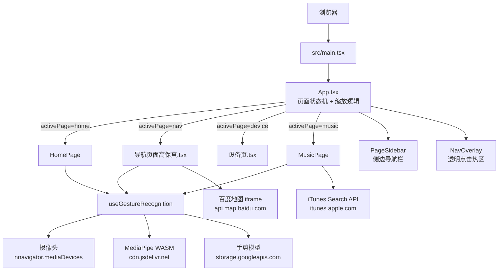

# 车载手势交互 UI 原型

基于 **React 18 + Vite 6 + TypeScript** 构建的车载信息娱乐系统 UI 原型，由 [Figma Make](https://www.figma.com/design/PKkE67WDzKI0LaWXIOLV6G/%E7%94%9F%E6%88%90-React---Vite-%E9%A1%B9%E7%9B%AE) 导出并扩展开发。核心亮点是通过 **MediaPipe 实时手势识别**驱动页面导航与媒体控制，模拟车载无触控交互场景。


---

## 功能特性

- **4 大页面**：主页仪表盘、导航地图、设备控制、音乐播放器
- **实时手势识别**：通过摄像头调用 MediaPipe GestureRecognizer，识别张手、握拳、大拇指等手势控制 UI
- **车载分辨率适配**：固定 1920×720 设计画布，自动等比缩放适配任意浏览器窗口
- **百度地图集成**：导航页通过 iframe 嵌入百度地图标记和地点搜索
- **音乐播放器**：内置歌单，通过 iTunes Search API 动态解析音乐预览链接
- **shadcn 风格组件库**：基于 Radix UI + Tailwind 的完整 UI 组件集

---

## 技术架构



### 导航机制

项目**不使用** React Router，页面路由通过 `App.tsx` 中的 `useState` 实现状态机切换：

```
activePage: "home" | "nav" | "device" | "music"
```

`NavOverlay` 组件在左侧边栏区域叠加透明点击热区，将点击事件映射到对应页面。手势识别通过 `onGesture` 回调触发相同的状态变更。

### 视口缩放逻辑

```
scale = min(window.innerWidth / 1920, window.innerHeight / 720)
```

内容区域固定为 1920×720，通过 `transform: scale(...)` 统一缩放，确保在不同分辨率设备上像素级还原设计稿。

---

## 目录结构

```
prototypeToDev/
├── index.html                    # SPA 入口，挂载 #root
├── vite.config.ts                # Vite 插件、路径别名配置
├── package.json
├── postcss.config.mjs
├── ATTRIBUTIONS.md               # 第三方资源许可声明
│
├── src/
│   ├── main.tsx                  # React 挂载点
│   │
│   ├── app/
│   │   ├── App.tsx               # 根组件：页面状态机 + 自适应缩放
│   │   ├── components/
│   │   │   ├── ui/               # shadcn 风格通用组件库
│   │   │   │   ├── button.tsx
│   │   │   │   ├── dialog.tsx
│   │   │   │   ├── chart.tsx     # recharts 封装
│   │   │   │   └── ...           # accordion, form, table, sidebar 等
│   │   │   ├── figma/
│   │   │   │   └── ImageWithFallback.tsx  # 图片加载失败占位
│   │   │   ├── HomePage.tsx      # 主页：仪表盘、手势摄像窗口、天气、mini 播放器
│   │   │   ├── MusicPage.tsx     # 音乐页：播放器、歌单、手势控制
│   │   │   └── PageSidebar.tsx   # 公共侧边导航栏
│   │   └── hooks/
│   │       └── useGestureRecognition.ts  # MediaPipe 手势识别 Hook
│   │
│   ├── imports/                  # Figma Make 导出的页面与资源
│   │   ├── 导航页面高保真.tsx      # 导航地图页
│   │   ├── 设备页.tsx             # 设备控制页
│   │   ├── 主页.tsx               # 早期主页草稿（未启用）
│   │   ├── 音乐DemoTest*.tsx      # 音乐页早期版本（未启用）
│   │   └── svg-*.ts              # SVG 路径数据模块（由 Figma 导出）
│   │
│   ├── assets/                   # 图片资源（Vite alias: figma:asset → ./src/assets）
│   │
│   └── styles/
│       ├── index.css             # 全局样式入口
│       ├── tailwind.css          # Tailwind 导入与 source 配置
│       ├── theme.css             # CSS 变量（设计 Token，支持 light/dark）
│       └── fonts.css             # 字体声明
│
└── dist/                         # 生产构建输出
```

---

## 快速启动

### 环境要求

- Node.js >= 18
- 支持摄像头的设备（手势识别功能必需）
- Chrome / Edge 最新版（推荐）

### 安装与运行

```bash
# 克隆项目
git clone <repository-url>
cd prototypeToDev

# 安装依赖
npm install

# 启动开发服务器
npm run dev

# 生产构建
npm run build
```

开发服务器默认运行在 `http://localhost:5173`。

> **注意**：摄像头访问需要安全上下文（`localhost` 或 `https://`）。若在局域网其他设备访问，需配置 HTTPS 或在 `vite.config.ts` 中启用 `server.https`。

---

## 外部资源依赖

项目无后端服务，所有外部资源均在客户端通过网络请求调用：

| 资源 | 地址 | 用途 | 网络要求 |
|------|------|------|----------|
| MediaPipe WASM 运行时 | `cdn.jsdelivr.net` | 手势识别 WebAssembly 模块 | 需要访问 jsDelivr CDN |
| MediaPipe 手势模型 | `storage.googleapis.com/mediapipe-models/` | GestureRecognizer 神经网络模型文件 | 需要访问 Google Cloud Storage |
| iTunes Search API | `https://itunes.apple.com/search` | 动态解析歌曲预览音频链接 | 需要访问 Apple API |
| 百度地图 | `https://api.map.baidu.com` | 导航页 iframe 地图展示 | 需要访问百度地图 API |

> 在网络受限环境（如无法访问 Google 服务）中，手势识别功能将无法加载模型，建议将模型文件本地化部署。

---

## 手势交互说明

手势识别由 `useGestureRecognition.ts` Hook 统一处理，通过 `requestAnimationFrame` 循环实时分析摄像头画面，并设置冷却时间防止连续误触。

### 支持的手势

| 手势 | MediaPipe 标签 | 触发条件 | 动作 |
|------|---------------|----------|------|
| 张开手掌向右划 | `Open_Palm` + x 轴位移 > 阈值 | 主页 / 导航页 | 切换到音乐页 |
| 张开手掌向左划 | `Open_Palm` + x 轴位移 < -阈值 | 音乐页 | 返回主页 |
| 握拳 | `Closed_Fist` | 音乐页 | 暂停 / 恢复播放 |
| 大拇指朝上 | `Thumb_Up` | 音乐页 | 上一首 |
| 大拇指朝下 | `Thumb_Down` | 音乐页 | 下一首 |
| 张开手掌向上划 | `Open_Palm` + y 轴位移 | 主页 | 切换到导航页 |

> 手势逻辑在不同页面略有差异，具体实现见 `HomePage.tsx` 和 `MusicPage.tsx` 中的 `onGesture` 回调。

---

## 核心依赖

### 运行时依赖

| 包 | 版本 | 用途 |
|----|------|------|
| `react` / `react-dom` | 18.3.1 | UI 框架 |
| `@mediapipe/tasks-vision` | latest | 手势识别 |
| `@radix-ui/react-*` | latest | 无障碍 UI 原语（Popover, Dialog, Tabs 等） |
| `@mui/material` / `@mui/icons-material` | latest | Material UI 组件 |
| `tailwindcss` | 4.x | 原子化 CSS |
| `class-variance-authority` + `clsx` + `tailwind-merge` | - | 动态 className 工具 |
| `recharts` | latest | 数据图表 |
| `motion` | latest | 动画库（Framer Motion） |
| `lucide-react` | latest | 图标库 |
| `react-hook-form` + `zod` | latest | 表单与数据验证 |
| `embla-carousel-react` | latest | 轮播组件 |
| `next-themes` | latest | 亮/暗主题切换 |
| `sonner` | latest | Toast 通知 |
| `date-fns` | latest | 日期处理 |
| `canvas-confetti` | latest | 彩带特效 |
| `react-dnd` | latest | 拖拽支持 |

### 开发依赖

| 包 | 版本 | 用途 |
|----|------|------|
| `vite` | 6.3.5 | 构建工具 |
| `@vitejs/plugin-react` | latest | React Fast Refresh |
| `@tailwindcss/vite` | 4.x | Tailwind CSS Vite 插件 |

---

## Vite 配置说明

`vite.config.ts` 中的关键配置：

```ts
// 路径别名
resolve: {
  alias: {
    "@": "./src",                  // 通用源码别名
    "figma:asset": "./src/assets", // Figma 导出的图片资源
  }
}

// 原始资源处理
assetsInclude: ["**/*.svg", "**/*.csv"]
```

---

## 浏览器要求

- **浏览器**：Chrome 90+ 或 Edge 90+（需支持 WebAssembly、getUserMedia）
- **摄像头**：使用手势控制功能必须授予摄像头权限
- **分辨率**：建议 1920×1080 或更大；UI 设计画布为 1920×720，会自动等比缩放适配小屏
- **网络**：首次加载需下载 MediaPipe WASM 和模型文件（约数 MB），建议网络畅通

---

## 设计来源

原始 Figma 设计稿：[生成 React + Vite 项目](https://www.figma.com/design/PKkE67WDzKI0LaWXIOLV6G/%E7%94%9F%E6%88%90-React---Vite-%E9%A1%B9%E7%9B%AE)

第三方资源许可见 [ATTRIBUTIONS.md](./ATTRIBUTIONS.md)。
